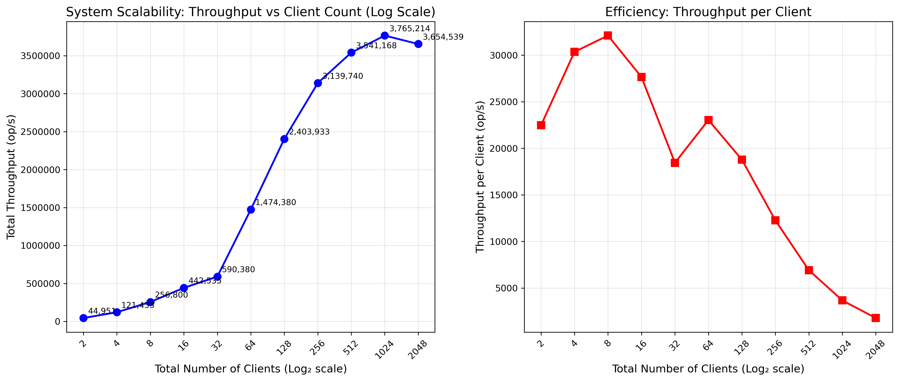

# High-Performance Key-Value Store

*Group members: Nafiur Rahman Khadem, Tuan D Le, Giang Ta, Sicheng Zhou*

## 1 Results

### With 4 nodes cluster

#### Final Throughput

```
Server nodes: node0 node1
Client nodes: node2 node3

node0 median 1761833 op/s
node1 median 1610980 op/s

total 3372813 op/s
```

#### Hardware Utilization

| Node | CPU Median (%) | Memory Median (%) | Network Median (%) |
|------|--------------|-----------------|------------------|
| Client 1 | 81.59% | 0.99% | 16.65% |
| Client 2 | 81.29% | 0.93% | 16.72% |
| Server 1 | 88.49% | 2.45% | 17.60% |
| Server 2 | 80.01% | 1.15% | 15.76% |

#### Scaling with increasing concurrent clients




### With 8 nodes cluster

#### Final Throughput

```
Server nodes: node0 node1 node2 node3
Client nodes: node4 node5 node6 node7

node0 median 1903520 op/s
node1 median 1653337 op/s
node2 median 1591488 op/s
node3 median 1513968 op/s

total 6662312 op/s
```

#### Hardware Utilization

| Node | CPU Median (%) | Memory Median (%) | Network Median (%) |
|------|--------------|-----------------|------------------|
| Client 1 | 83.99% | 0.96% | 17.95% |
| Client 2 | 84.49% | 0.94% | 17.33% |
| client 3 | 84.66% | 0.95% | 17.38% |
| client 4 | 84.35% | 0.95% | 17.61% |
| Server 1 | 87.29% | 2.45% | 20.31% |
| Server 2 | 81.34% | 1.14% | 17.50% |
| server 3 | 79.58% | 1.16% | 16.75% |
| server 4 | 79.76% | 1.15% | 15.91% |

## 2 Design

Our design process culminated in two distinct, high-performance, and linearizable implementations, each prioritizing a different performance philosophy. Our primary solution, detailed in the performance analysis which can be accessed in **commit-monitoring-results** folder, strictly adheres to the workload generator's global order, achieving a remarkable final throughput of over 6.7 million ops/s. To explore the absolute performance limits of the architecture, we also researched a second solution designed to bypass the bottleneck inherent in the first. This alternative employed a fully asynchronous, non-blocking client that dispatches both GET and PUT batches to all servers in parallel, yielding a significantly higher average throughput of 12 million ops/s on 4 nodes and 16 million ops/s on 8 nodes. Playing around with the configuration of 256 concurrent clients and ~ 10,000 in batch size, we were able to get this up to about 30 millions ops/s on 8 nodes. However, we did not select this as our main solution as its parallel nature does not preserve the global operation order of the workload generator, a specific constraint of the assignment. However, given that requests are sharded to independent, non-replicated servers, both designs are perfectly linearizable solutions.

Our initial design bottleneck, evident in the baseline performance of ~10,000 ops/s, was the inability to generate sufficient load to stress a distributed system. The first major architectural breakthrough was to scale request distribution to all available servers and using concurrent client goroutines. This change was not merely an optimization but a bug fix to the original design that enables us to properly test the system's limits. The rationale was that a distributed backend is meaningless without a distributed client load. This single change yielded a **+6,700% performance increase** to 1.3M ops/s. Following this, our analysis showed the system had become network-bound. To solve this, we implemented **client-side batching of GET requests**, which amortized the cost of network latency over many operations. This choice was validated by another **+361% jump** in throughput to over 6M ops/s, confirming that network round-trip time had been the second major bottleneck.

With the new architecture in place, we considered design alternatives for server-side concurrency. The initial change from a native Go map to a sync.Map was a critical choice for correctness and enabling concurrency, ensuring linearizability. While the data shows a minor 2.0% performance regression, this was a necessary trade-off for a thread-safe implementation. Later, once the server was handling large batches, our analysis identified a new bottleneck: severe lock contention in the BatchGet handler. The fix in to lock the stats mutex only once per batch yielded a significant +10.5% gain. We also experimented with alternatives, such as replacing the mutex with an atomic counter. However, the negligible +0.1% improvement indicated that after the primary fix, the mutex was no longer a significant point of contention, making sync.Map the correct and sufficient tool for the job.
### Why is this linearizable?

Given failure-free cases, our implementation complies with linearizability through a combination of deterministic sharding between server nodes, the use of **sync.Map** on each of these nodes and strict, sequential executions with respect to global order of the workload generator.
#### Sharding 
We kept the key distribution tactics relatively simple: `hostId := int(op.Key % uint64(len_hosts))`. This means that for any given key, all corresponding operations are directed to the exact same server. There is no ambiguity causing by any replications tactics or two servers storing the same states for the same key and it effectively partition the key space into independent sets.
#### sync.Map offers atomic and lock-free operations
**Load** and **Store** provided by **sync.Map** are the core functions behind our **GET** and **PUT** RPC methods and are atomic by nature to make operations linearizable in plain view. **sync.Map** implements a two-map structures behind the scene where one is a read-only map that offer lock-free lookup for data and a dirty map which is just regular Go native map for recording entry. It was an effective replacement where we are bench-marking with YCSB-B workload of heavy read to offer efficient look-up without locking mechanism and still ensure some valid sequential execution history.

#### Batching strategy
The core guarantee of global order lies in `runClient` main loop where we buffered **GET** requests and have their execution time controlled by the handling of **PUT** requests. When the workload generator produces a **PUT** operation, two things happen:
- Client first "flushes" out batch of **GET** requests and pauses the entire client loop until the server has processed the batch and sent a response.
- After the batch returns, client finally calls **PUT**.
This ensures that each operations generated by workload generator have to be fully executed in order in a blocking manner with respect to its original order.

##### Example concurrent write and batch read
Given 4-node clusters with 2 servers (s0, s1) and 2 clients (c0, c1). Key are then sharded by `key % 2`. Even keys go to s0 and odd keys to s1.

1. Initial state: `key = 22` has value X on server s0
2. Time 1: c0 invokes `Put(key=22, value="Y"`. The request in-flight to s0
3. Time 2: c1 invokes `BatchGet` for a list of keys that includes `key=22`. This also in-flight to s0

There are two possible outcomes:
- `PUT` linearizes first: `mp.Store("22", "Y")` completes and immediately, `mp.Load("22")` runs as part of the `BatchGet`. The `BatchGet`. The `BatchGet` is ensured to read the "Y" and respond to c1 with the value. No matter how many GET requests in the batch, they all subsequently reflect this value.
- `BatchGET` linearizes first: `mp.Load("22")` finishes and prepares to respond "X" to c1. Right after this, `mp.Store("22", "Y")` comes through and overwrite the value, ensuring any subsequent incoming GET will reflect this value.

These are expected linearizable outcomes given that the system works perfectly. However, it's prone to violate this easily when issues arises given its lack of replication and mechanism to recover.

## 3 Reproducibility

**Step-by-step instructions.** Run `./run-cluster.sh`.

**Hardware requirements and setup.** 4 or 8 CloudLab m510 machines.

**Software dependencies and installation.**

**Configuration parameters and their effects in particular if you've added "knobs".**

## Reflections

This assignment gave us a more practical overview into what building high-performance concurrent system entail. **Bottleneck analysis** was the most important part in our approach. We learn that the process is iterative and sometimes it was a matter of identifying and prioritizing the most significant constraints. This would have not worked if we just dive right in to apply known methodology. Monitoring the log and network latency, we were able to identify that all requests were being routed to only one server. After successfully increasing the throughput by multiplying concurrent clients, we notice that vertically scaling clients started falling off after a certain amount and prompted us to seek request batching as an option.

We also learn that the process is about making the right balance between correctness and performance. The trade-off in providing a high throughput system but inaccurate is meaningless if it cannot guarantee the integrity of its data under concurrent access.

### What optimizations worked well and why?
1. Sharding Requests: It enabled true concurrent runs of operations and allowed hardware to use max capacity of its network resources to make more requests.
2. Swapping native Go map for `sync.Map`: Specifically designed for concurrent read-heavy workloads. It provides fine-grained, atomic access to its elements and allows many goroutines to read and write in parallel without using normal mutex lock.
3. Batching GET requests: Reduce network latency by making less round trips. We amortized the cost of making hundreds of GET requests concurrently so client machines can issue more requests.

### What didn't work and lessons learned

1. Manual concurrency vs `sync.Map`: We attempted to manage concurrency manually with `sync.RWMutex` over a native Go map, and later with a more complex sharded map implementation. We eventually learned how optimized standard library option was in the case of `sync.Map` as it was hard to beat to its intended use case. The operations were near lock-free and read operations were concurrently fast. Our initial design were theoretically correct but we should benchmark against provided solutions before attempting to reinvent the wheel.
2. Memory optimization with `sync.Pool`: To reduce latency from garbage collection, we implemented a `sync.Pool` to reuse `GetRequest` objects. However, this had negligible impact on throughput. Micro-optimization like this is only effective when they are the primary target bottleneck. In our case, network latency was a bigger problem. It taught us to use profiling tools for better investigation before investing effort into optimization.
3. Server-side LRU Cache: We added an LRU cache on server, thinking it would speed up the most accessed keys generated by Zipfian workload which was not the case. This was only adding more overhead to a highly optimized solution like `sync.Map`.
4. Formal verification of linearizability with Porcupine: We wanted to formally verify the system's linearization points by incorporating a custom logger to capture the invoke/response history of every operations and ran Porcupine checker on top of them. However, the volume of logs generated by 256 concurrent clients performing millions of operations quickly consumed all available memory, crashing the verifier. This was a useful idea that we love to try but just could not figure a solution in time for the project deadline.

### Ideas for further improvement

1. Trying a different protocol & serialization method: Due to complexity and time-constraint, we could not look into swapping out the native `gob` serialization scheme provided by `net/rpc`. Although we are not entirely sure if this would improve the bottleneck in network latency, we hypothesize that migrating to gRPC using Protobuf could reduce the overhead in serializing the requests.
2. Client-side caching: Despite server caching not working out, we believe in a real world scenario where high availability is favored and some sacrifice in linearizability is tolerable, client-side caching can be an option to serve more read-heavy workload.
