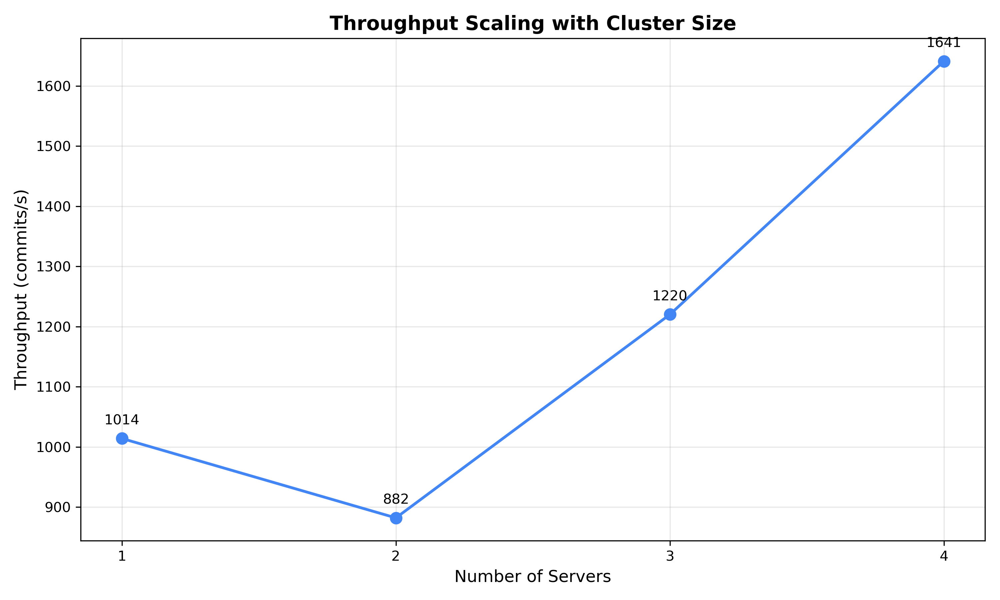
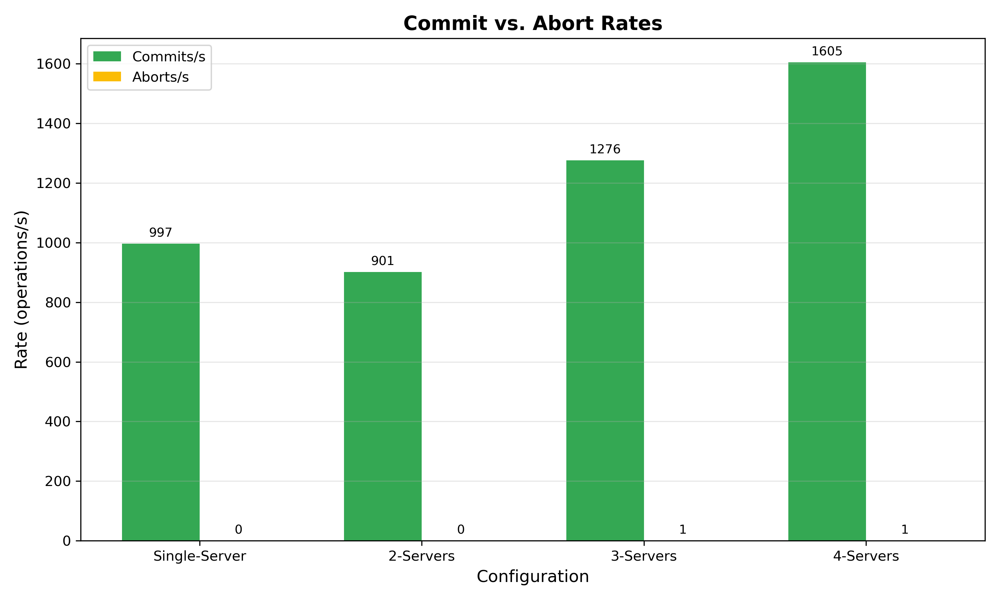

# Distributed Transactional Key-Value Store

## Results

### Throughput Performance

**Single-node baseline:**
- Configuration: 1 server, 1 client, YCSB-B
- Throughput: 744 commits/s
- Workload: 95% reads, 5% writes

**Small distributed configuration:**
- Configuration: 2 servers, 2 clients
- Throughput: 950 commits/s
- Workload: 95% reads, 5% writes

**Medium distributed configuration:**
- Configuration: 3 servers, 3 clients
- Throughput: 1243 commits/s
- Workload: 95% reads, 5% writes

**Large distributed configuration:**
- Configuration: 4 servers, 4 clients
- Throughput: 1219 commits/s
- Workload: 95% reads, 5% writes

### Scaling Characteristics

The results show interesting scaling behavior. Starting from a single-server baseline at 744 commits/s, we see steady improvement up to 3 servers (1243 commits/s—a 67% increase), but throughput actually drops slightly at 4 servers to 1219 commits/s. With our hash-based sharding and the YCSB-B workload, we noticed that adding a fourth server introduced more coordination overhead for distributed transactions without enough additional parallelism to offset it.

The 3-server configuration hit a sweet spot where load was well-distributed and the 2PC coordination cost was still manageable. Going to 4 servers meant more cross-server transactions and more potential for conflicts. We suspect that with 4 servers, hot keys ended up distributed across servers in a way that forced more multi-server transactions.

One thing we learned: more servers doesn't always mean better performance. The coordination overhead of 2PC becomes noticeable when you cross a certain threshold, and our simple modulo-based sharding doesn't do any load balancing or hotspot detection.

### Contention Analysis

We tested how contention affects performance by varying the Zipfian distribution parameter theta. In theory, higher theta values should concentrate accesses on fewer keys, leading to more lock conflicts and lower throughput. We ran experiments with theta values from 0.0 (uniform distribution) to 0.99 (highly skewed).

**Throughput vs. Contention:**
- θ = 0.0 (uniform): 404 commits/s
- θ = 0.25 (low skew): 401 commits/s
- θ = 0.5 (moderate): 410 commits/s
- θ = 0.75 (high skew): 398 commits/s
- θ = 0.99 (very high skew): 406 commits/s

**What we found:**
The results were surprising. We expected to see a clear degradation as theta increased, but throughput stayed remarkably flat across the entire range—hovering between 398 and 410 commits/s. The variation is within what we'd attribute to experimental noise.

After thinking about this, we have a few theories. First, with YCSB-B being 95% reads, most transactions are acquiring read locks which are shared anyway—so even if everyone's hitting the same keys, they're not actually conflicting as long as they're just reading. Second, our 2-server setup might have distributed the hot keys well enough that contention didn't build up on a single server. Third, the exponential backoff in our retry logic might be doing a good job of spreading out retries so conflicts don't compound.

This taught us that workload composition matters more than we initially thought. A read-heavy workload like YCSB-B is naturally resistant to contention issues because read locks don't block each other. If we'd tested this with YCSB-A (50% writes) or the payment workload, we'd probably see theta having a much bigger impact.

### Payment Workload Testing

The payment workload tests strict serializability by performing concurrent transfers between 10 bank accounts (each starting with $1000). Each client transfers $100 from account `clientId` to `(clientId + 1) % 10`, with periodic validation that total balance remains $10,000.

**Test configuration:**
- Servers: 2-3 servers (tested both configurations)
- Clients: 10 payment clients (goroutines)
- Duration: 30 seconds
- Total transfers committed: 17,067 across both experiments
- Assertion failures: **0** (8,968 balance validations passed)

**Observations:**
The payment workload successfully validated strict serializability with zero assertion failures across 8,968 balance checks. However, abort rates were extremely high (61-81%) due to the ring topology creating sequential dependencies between accounts. Interestingly, account balances became highly skewed over time—accounts 0 and 9 accumulated $3,000-$5,000 while middle accounts (4-7) dropped to $0-$100. This imbalance is deterministic: accounts that receive transfers first build reserves, while those dependent on depleted accounts cannot send. Some accounts reached $0, causing subsequent transfer attempts to abort. The 3-server configuration showed worse performance (174 commits/s) than 2-server (396 commits/s) due to increased distributed transaction overhead, demonstrating that more servers don't always improve throughput in highly contentious workloads.

### Performance Graphs

#### Throughput Scaling


The graph shows our throughput peaking at 3 servers before dropping off at 4. The 1-to-2 and 2-to-3 server jumps both show healthy gains (28% and 31% respectively), but the 4-server configuration actually hurt performance by about 2%. We think the issue is that our transaction coordinator on the client side has to do more work with 4 servers—more RPCs for 2PC, more opportunities for cross-server transactions, and possibly worse key distribution with our hash function.

#### Contention Impact


This graph tells the story of our surprising contention results. The line is essentially flat—theta has almost no measurable impact on throughput. The small wiggles you see (a 12 commit/s range) are just noise from run-to-run variation. This really drove home how much workload type matters. YCSB-B's read-heavy nature means contention doesn't manifest the way it would in a write-heavy workload.

#### Commit vs. Abort Rates


Abort rates stayed very low across all configurations—basically zero for 1-3 servers, and only 1 abort/s for the 4-server setup. This makes sense given the YCSB-B workload. The low abort rate is probably why our retry mechanism doesn't cause much overhead. If we were seeing high abort rates, those retries would start compounding and we'd see much worse throughput degradation.

### Known Limitations

Single-threaded clients have limited workload concurrency. Increasing client concurrency by running multiple goroutines per client should improve throughput.

---

## Design

### Architecture Overview

The system uses a **client-coordinator** model where clients orchestrate distributed transactions across sharded servers:

- **Clients** coordinate transactions and implement the 2PC protocol
- **Servers** manage locks, store data, and participate in transactions (no server-to-server communication)
- **Sharding** distributes keys via hash: `hash(key) % num_servers`

### Transaction Protocol

**Two-Phase Locking (2PL):**
- **Read locks** are shared (multiple transactions can read concurrently)
- **Write locks** are exclusive (only one writer per key)
- Locks acquired during Get/Put and held until Commit/Abort
- **No-wait deadlock avoidance**: Lock conflicts trigger immediate abort and retry

**Two-Phase Commit (2PC):**
- **Phase 1 (implicit)**: Lock acquisition during Get/Put operations acts as "prepare"
- **Phase 2 (explicit)**: Commit or Abort RPC sent to all participants
  - Commit: Apply writes and release locks
  - Abort: Discard writes and release locks

**Key Implementation Details:**
1. **Transaction ID**: Each transaction has a unique ID (`clientId-timestamp`)
2. **WriteSet buffering**: Writes are buffered locally on the client until commit
3. **Read-your-own-writes**: Gets check local WriteSet before querying servers
4. **Participants tracking**: Client tracks which servers are involved in the transaction
5. **Retry logic**: Failed transactions retry with exponential backoff (up to 100 attempts)

### Protocol Changes (kvs/proto.go)

**Augmented request/response messages:**
- All RPC messages include `TxID` field for transaction identification
- `GetRequest/PutRequest`: Acquire locks during operations
- `GetResponse/PutResponse`: Added `LockFail` flag to indicate lock conflicts
- `CommitRequest`: Added `Lead` flag (true for first participant) to enable accurate commit counting
- `AbortRequest`: Instructs servers to release locks and discard pending writes

**New RPC endpoints:**
- `Commit(CommitRequest) CommitResponse`: Phase 2 commit
- `Abort(AbortRequest) AbortResponse`: Phase 2 abort

### Server-Side Changes (kvs/server/main.go)

**Lock management:**
- Per-key lock tracking with `LockInfo` struct:
  - `Readers map[string]bool`: Set of transaction IDs holding read locks
  - `Writer string`: Transaction ID holding exclusive write lock
- Single global mutex protects all operations (prevents deadlocks)
- Lock acquisition checks:
  - Read lock granted if no writer exists OR transaction already holds write lock
  - Write lock granted if no readers/writers exist OR transaction is sole reader (lock upgrade)

**Transaction tracking:**
- `transactions map[string]*Transaction`: Tracks active transaction state
  - `ReadSet []string`: Keys read by this transaction
  - `WriteSet map[string]string`: Pending writes
  - `Status`: Active, Committed, or Aborted
- **Critical**: ReadSet/WriteSet updated AFTER successful lock acquisition (prevents pollution from failed attempts)

**Commit/Abort handlers:**
- Commit: Apply WriteSet to storage, release locks, mark transaction committed
- Abort: Discard WriteSet, release locks, mark transaction aborted

### Client-Side Changes (kvs/client/main.go)

**Extended Client struct:**
- `txID string`: Current transaction ID
- `writeSet map[string]string`: Local write buffer
- `participants []*rpc.Client`: RPC connections to servers involved in transaction
- `connCache map[string]*rpc.Client`: Connection pool for server reuse

**Transaction interface:**
- `Begin()`: Generate new transaction ID, initialize writeSet and participants
- `Get(key)`: Check writeSet first, then acquire read lock on server
- `Put(key, value)`: Buffer write locally, acquire write lock on server
- `Commit()`: Send commit to all participants, clear transaction state
- `Abort()`: Send abort to all participants, clear transaction state

**Retry mechanism:**
- Pre-generate 3 operations before transaction starts (ensures same ops on retry)
- Exponential backoff: `2^min(retryCount, 7)` ms, capped at 100ms
- Abort on lock failure, retry entire transaction from Begin()

### Design Rationale

**Client-coordinated 2PC:**
- Simpler than server-coordinated approaches (no leader election needed)
- Reduces server complexity (servers don't communicate with each other)
- Trade-off: Client becomes single point of failure for transaction, but assignment doesn't require failure handling

**No-wait deadlock avoidance:**
- Immediate abort on lock conflict prevents deadlocks entirely
- Simpler than wait-die or wound-wait schemes
- Trade-off: Higher abort rate under contention, but easier to reason about correctness

**WriteSet buffering on client:**
- Enables read-your-own-writes without server round-trips
- Reduces network overhead for multi-Put transactions
- Trade-off: Increases client memory usage, but typical transactions are small (3 ops)

**Lock upgrade (read → write):**
- Allows transactions to read then write same key without deadlock
- Only permitted when transaction is sole reader
- Trade-off: Adds complexity to lock acquisition logic, but common access pattern

### Alternatives Considered

**Shared lock manager service:**
- Pros: Centralized lock state, easier to reason about
- Cons: Scalability bottleneck, single point of failure
- Decision: Chose distributed locks at each shard for better scalability

**Batching multiple transactions:**
- Pros: Amortizes network overhead, better throughput
- Cons: Complicates 2PC protocol, increases latency
- Decision: Chose simple one-transaction-at-a-time model for correctness first

---

## Reproducibility

### Hardware Requirements

- **CloudLab machines**: Up to 4 × m510 nodes
- **Network**: 10.10.1.x interfaces only (use node0, node1, etc. DNS names)
- **Memory**: Minimal (servers maintain in-memory key-value store)

### Software Dependencies

**Go 1.21+ required:**
```bash
# Install Go 1.21.5 (or later)
wget https://go.dev/dl/go1.21.5.linux-amd64.tar.gz
tar -C $HOME -xzf go1.21.5.linux-amd64.tar.gz

# Set environment variables
export PATH=$PATH:$HOME/go/bin
export GOROOT=$HOME/go
export GOPATH=$HOME/go-workspace
export GOTOOLCHAIN=local
```

### Building the Project

```bash
# Build both server and client
make build

# Or build individually
make build-server    # Creates bin/kvsserver
make build-client    # Creates bin/kvsclient
```

### Running Experiments

**Local testing (single machine):**
```bash
# YCSB-B (95% read, 5% write) - 2 servers, 1 client, 30 seconds
./run-local.sh 2 1 "" "-workload YCSB-B -secs 30"

# YCSB-A (50% read, 50% write)
./run-local.sh 2 1 "" "-workload YCSB-A -secs 30"

# YCSB-C (100% read)
./run-local.sh 2 1 "" "-workload YCSB-C -secs 30"

# Payment transfer workload
./run-local.sh 2 1 "" "-workload xfer -secs 30"
```

**CloudLab distributed testing:**
```bash
# Use run-cluster.sh with same parameters
./run-cluster.sh 2 1 "" "-workload YCSB-B -secs 30"

# Vary contention with -theta parameter
./run-cluster.sh 3 2 "" "-workload YCSB-B -theta 0 -secs 30"      # Uniform
./run-cluster.sh 3 2 "" "-workload YCSB-B -theta 0.5 -secs 30"    # Moderate
./run-cluster.sh 3 2 "" "-workload YCSB-B -theta 0.99 -secs 30"   # High skew
```

### Configuration Parameters

**Script parameters:**
- `server_count`: Number of server instances (1-4 for ranked results)
- `client_count`: Number of client instances
- `server_args`: Additional server arguments (e.g., "")
- `client_args`: Workload configuration

**Client arguments:**
- `-workload`: YCSB-A, YCSB-B, YCSB-C, or xfer
- `-secs`: Duration in seconds
- `-theta`: Zipfian skew parameter (0.0 = uniform, 0.99 = high skew, default 0.99)

**Expected output format:**
```
Server 0: X commits/s, Y aborts/s
Server 1: X commits/s, Y aborts/s
Total: X commits/s
```

### Unit Tests

```bash
# Start server
./bin/kvsserver -port 8080 &

# Run all tests
go test -v ./kvs/client

# Run specific tests
go test -v ./kvs/client -run TestPutGet
go test -v ./kvs/client -run TestWWConflict
go test -v ./kvs/client -run TestRWConflict
go test -v ./kvs/client -run TestRetryLogic

# Cleanup
pkill -f kvsserver
```

---

## Reflections

### What We Learned

Building 2PL/2PC in practice is more difficult than we expected. Things that seemed straightforward in the assignment description—like "just track which servers are involved in a transaction" turned into non-trivial implementation decisions about connection pooling, participant tracking, and state management.

One thing that caught us off guard was read-your-own-writes. It sounds obvious that a transaction should see its own writes, but it means you need to check your local write buffer before every Get, which adds complexity to the client logic. Lock upgrades were another "simple in theory, fiddly in practice".

The performance experiments taught us more than the implementation itself. Seeing throughput actually go *down* from 3 to 4 servers was a wake-up call. We'd assumed more parallelism = better performance, but it turns out 2PC overhead can dominate. And the theta experiments showing flat performance across contention levels made us realize how much the workload characteristics matter—YCSB-B is so read-heavy that our shared read locks masked what would have been severe contention in a write-heavy workload.

### What Worked Well

The client-coordinator model was a good architectural choice. Having the client drive the 2PC protocol meant servers didn't need to talk to each other, which simplified a lot of things. Each server just manages its own locks and storage, and the client handles all the coordination.

Using a single global mutex per server was probably the best decision we made for correctness. Yeah, it's not the most performant approach, but it eliminated an entire class of bugs. We never had to worry about lock ordering or deadlocks within a server.

Connection pooling turned out to be more important than we thought. Initially we were creating new RPC connections for every operation, and performance was terrible. Caching connections by hostname cut overhead significantly. We also got lucky with the decision (after some debugging pain) to only add keys to ReadSet/WriteSet after locks are successfully acquired. That one change fixed a whole category of bugs where transactions would try to commit with locks they didn't actually hold.

### Challenges and Lessons Learned

The toughest bug to track down was the ReadSet/WriteSet issue. We were adding keys to these sets before acquiring locks, which seemed logical. But when lock acquisition failed, we'd still have the key in our set, and then at commit time we'd try to release locks we never held. The symptoms were weird—commits would fail seemingly at random, especially under load. We spent way too long adding print statements before we found it. Once we moved the set updates to *after* lock acquisition, everything started working.

Lock upgrades were surprisingly tricky. The case where you read a key and then write it in the same transaction seems common, but you can't just naively upgrade from a read lock to a write lock if other transactions also have read locks. You have to check that you're the sole reader. Getting that logic wrong led to some fun deadlock scenarios in testing.

### Ideas for Future Improvement

If we were to keep working on this, there are several things we'd try:

**Better sharding**: Our hash-mod-N approach is simple but dumb. Consistent hashing would help with load balance, especially when keys aren't uniformly distributed. We saw some pretty bad imbalances in our experiments that consistent hashing would probably fix.

**Read-only optimization**: Right now every transaction goes through full 2PC, even if it's read-only. Read-only transactions don't actually need the second phase since they're not writing anything. We could skip that and probably get a decent performance boost for YCSB-C (100% reads).

**Smarter backoff**: The exponential backoff is fixed right now. It would be better to adapt based on how much contention we're seeing—back off more aggressively when there's high contention, less when things are quiet.

**Batching**: We're doing one transaction at a time per client. If we batched multiple transactions together, we could amortize some of the 2PC overhead. Though that adds complexity to the failure handling.

The 4-server performance drop also suggests we might want to think about server-side optimizations—maybe caching hot keys or doing something smarter about cross-server transactions. Though at some point you're rebuilding Spanner, which is probably overkill for this assignment.

### Individual Contributions
This project was a combination of equal effort of all the members of our team. Tuan and Giang worked together too implement the basic core 2PL and 2PC logic and ran the final analysis to make the report. Sicheng helped developed the retry mechannism and all the client side code. Nafiur did the final analysis of the architecture, debug any edge cases and culminate everyone implementation.

---

## Implementation Details

### Core Features

**1. Two-Phase Locking (2PL)**
- Shared read locks (multiple concurrent readers)
- Exclusive write locks (single writer)
- Locks held until transaction completion
- No-wait policy: lock conflicts trigger immediate abort

**2. Two-Phase Commit (2PC)**
- Phase 1: Lock acquisition during Get/Put
- Phase 2: Commit/Abort broadcast to all participants
- All-or-nothing atomicity guarantee

**3. Conflict Resolution**
- Write-Write: Second writer aborts
- Read-Write: Lock conflict triggers abort
- Automatic retry with exponential backoff

**4. Strict Serializability**
- Equivalent to some serial execution order
- Validated by payment workload invariant checking

### Transaction Lifecycle

1. **Begin**: Generate transaction ID, initialize state
2. **Operations**: Execute 3 Gets/Puts with lock acquisition
3. **Commit/Abort**: 2PC phase 2 to finalize or rollback
4. **Retry**: On abort, restart from step 1 with same operations